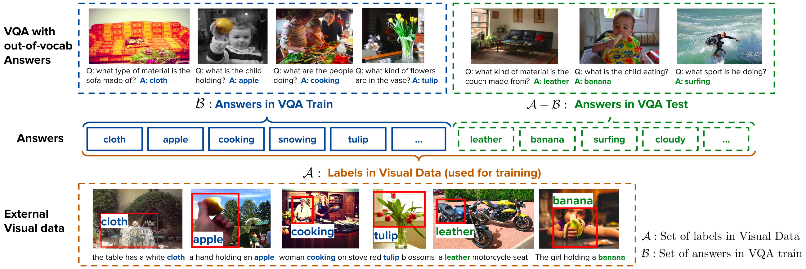

# Transfer Learning via Unsupervised Task Discovery <br/>for Visual Question Answering
Hyeonwoo Noh, Taehoon Kim, Jonghwan Mun, Bohyung Han
<div>

</div>

This is official source code for the paper entitled **Transfer Learning via Unsupervised Task Discovery for Visual Question Answering**, which proposes an algorithm for exploiting off-the-shelf visual data such as bounding box annotations or region descriptions for VQA with out-of-vocabulary answers.
This repository includes all information reproducing results presented in the paper. It includes dataset, model, hyper parameters and plotting results.

If you find this open source release useful, please reference in your paper:
```
@inproceedings{noh2019transfer,
  title={Transfer Learning via Unsupervised Task Discovery for Visual Question Answering},
  author={Noh, Hyeonwoo and Kim, Taehoon and Mun, Jonghwan and Han, Bohyung},
  booktitle={Proceedings of the IEEE conference on computer vision and pattern recognition},
  year={2019}
}
```

## Requirements
* python2.7
* NVIDIA GPU with at least 1.2 GB memory
* At least 128 GB ram (for preloading all features into memory for faster learning)

### Setting with virtual environment

This code was tested under ubuntu 16.04 based on the following virtual environment setting.
We use a virtual environment with python 2.7.
```bash
virtualenv --system-site-packages -p python2.7 ~/venv_vqa_task_discovery
```
Activate the virtual environment with the command
```bash
source ~/venv_vqa_task_discovery/bin/activate
```
The python dependencies are installed by running the script
```bash
pip install -r requirements.txt
```

## Dataset preparation
Instructions for preparing datasets for pretraining and transfer to VQA is described in [this document](doc/dataset.md).

## Learning and evaluation
Instructions for learning models and performing evaluation to reproduce results in the main paper is described in [this document](doc/learning.md)
